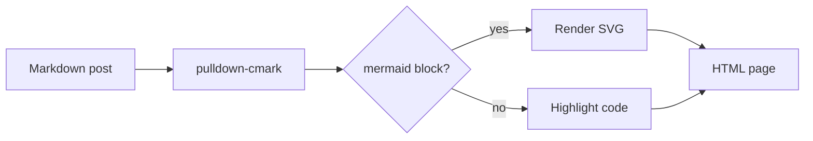
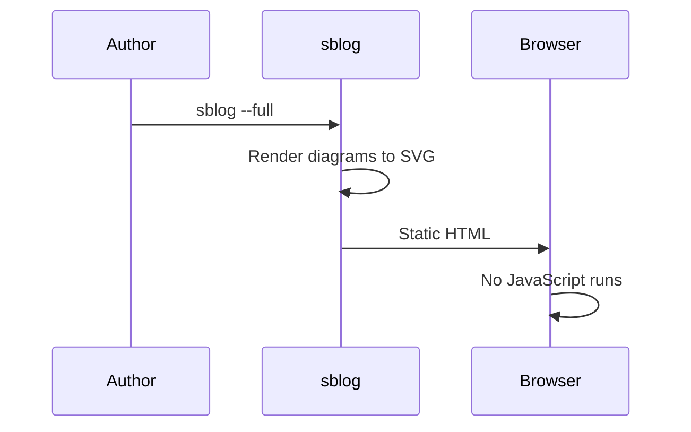

Posts can carry visual blocks. A visual block sits in the center of the
article. Text flows above and below it. A title shows below the visual.

## Images

An image with a title renders as a centered figure. The caption comes
from the markdown link title.

An image without a title renders centered, with no caption.

## Mermaid diagrams

A fenced block tagged `mermaid` renders to SVG at build time. The words
after `mermaid` in the info string become the caption. Diagrams follow
the site theme.

## Text around figures

Text above and below a figure flows normally. The figure stays centered
between the paragraphs. Long captions wrap inside the figure width.
